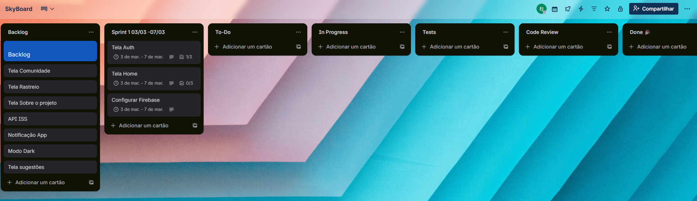

# 🌌 SkyBoard

pt:
**SkyBoard** é um aplicativo mobile em desenvolvimento para amantes da astronomia e astrofotografia. O objetivo é fornecer ferramentas precisas para observação do céu, monitoramento de eventos astronômicos e gerenciamento de sessões de captura.

## 🚀 Funcionalidades Planejadas
1\. **Dashboard de Eventos**: Calendário dinâmico com notificações de eclipses, conjunções e chuvas de meteoros.

2\. **Rastreador de Astros e ISS**: Mapa em tempo real da Estação Espacial e coordenadas (Azimute/Altitude) de planetas. (N2YO API)

3\. **Índice de Seeing (Antoniadi)**: Algoritmo que traduz dados meteorológicos complexos em uma nota de estabilidade atmosférica.

4\. **Aba de Recomendações**: Curadoria de equipamentos com links de afiliados (Monetização Passiva).

5\. **Comunidade Social**: Feed de fotos/vídeos com metadados técnicos (equipamento usado) e links para redes sociais dos usuários.

6\. **IA Astro-Grader (Futuro)**: Sistema de análise de fotos para dar notas e dicas de melhoria.

## 🛠️ Tecnologias Utilizadas

- [React Native](https://reactnative.dev/) - Framework para apps nativos.
- [Expo](https://expo.dev/) - Plataforma de desenvolvimento e build.
- [Firebase](https://firebase.google.com/) - Autenticação e infraestrutura de backend.
- [TypeScript](https://www.typescriptlang.org/) - Tipagem estática para maior segurança do código.
- [React Navigation](https://reactnavigation.org/) - Roteamento e navegação.

## 📦 Instalação e Execução

Para rodar o projeto localmente, siga os passos abaixo:

1. **Clone o repositório:**
   ```bash
   git clone [https://github.com/JuniorGCY/SkyBoard-Mobile.git](https://github.com/JuniorGCY/SkyBoard-Mobile.git)

2. **Instale as dependências:**
   npm install

3. **Inicie o servidor de desenvolvimento:**
   npx expo start

4. **Execute no emulador ou dispositivo físico:**
   Pressione a para Android ou i para iOS.


## 🗺️ Planejamento e Design

Para acompanhar a evolução do SkyBoard e entender o processo criativo, você pode acessar:

* [**Protótipo no Figma**](https://www.figma.com/design/YHQnZHZC0feifBPGfbX6fk/SkyBoard?m=auto&t=Frw4QtaIZA0KslEc-1) - Design de interface e experiência do usuário.
* [**Planejamento no Trello**] - Roadmap de funcionalidades, bugs conhecidos e tarefas em progresso.

<details>
  <summary>📸 Clique para ver o quadro de planejamento</summary>
  <br />
  
</details>


🛡️ Direitos Autorais
Este projeto é de uso pessoal e faz parte do meu portfólio de desenvolvimento mobile.
Todos os direitos reservados. A visualização do código é permitida para fins de aprendizado e avaliação técnica, mas a reprodução, modificação ou redistribuição de partes ou do todo não está autorizada sem permissão prévia.


EN:
**SkyBoard** It is a mobile application under development for astronomy and astrophotography enthusiasts. The goal is to provide precise tools for observing the sky, monitoring astronomical events, and managing capture sessions.

## 🚀 Planned Features

1. **Events Dashboard**: Dynamic calendar with notifications for eclipses, conjunctions, and meteor showers.

2. **Astrological and ISS Tracker**: Real-time map of the Space Station and coordinates (Azimuth/Altitude) of planets. (N2YO API)'
'
3. **Seeing Index (Antoniadi)**: An algorithm that translates complex meteorological data into an atmospheric stability score.

4. **Recommendations Tab**: Curated selection of equipment with affiliate links (Passive Monetization).

5. **Social Community**: Feed of photos/videos with technical metadata (equipment used) and links to users' social networks.

6. **AI Astro-Grader (Future)**: Photo analysis system to provide ratings and improvement tips.

## 🛠️ Technologies Used

- [React Native](https://reactnative.dev/) - Framework for native apps.

- [Expo](https://expo.dev/) - Development and build platform.

- [Firebase](https://firebase.google.com/) - Authentication and backend infrastructure.

- [TypeScript](https://www.typescriptlang.org/) - Static typing for greater code security.

- [React Navigation](https://reactnavigation.org/) - Routing and navigation.

## 📦 Installation and Execution

To run the project locally, follow the steps below:

1. **Clone the repository:**

``bash

git clone [https://github.com/JuniorGCY/SkyBoard-Mobile.git](https://github.com/JuniorGCY/SkyBoard-Mobile.git)

2. **Install the dependencies:**

npm install

3. **Start the development server:**

npx expo start

4. **Run on the emulator or physical device:**

Press a for Android or i for iOS.


## 🗺️ Planning and Design

To follow the evolution of SkyBoard and understand the creative process, you can access:

* [**Prototype in Figma**](https://www.figma.com/design/YHQnZHZC0feifBPGfbX6fk/SkyBoard?m=auto&t=Frw4QtaIZA0KslEc-1) - User interface and experience design.
* [**Planning in Trello**] - Roadmap of features, known bugs, and tasks in progress.

<details>
  <summary>📸 Click to view the planning board.</summary>
  <br />
  
</details>


🛡️ Copyright Notice
This project is for personal use and is part of my mobile development portfolio.

All rights reserved. Viewing the code is permitted for learning and technical evaluation purposes, but reproduction, modification, or redistribution of parts or the whole is not authorized without prior permission.

